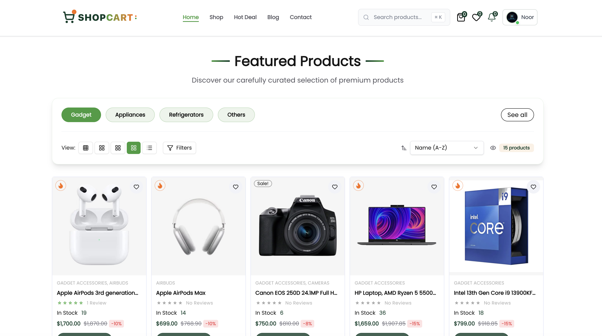

# 🛒 NCSEcom Pro - Complete E-Commerce Platform

<div align="center">

[](https://nextjs.org/)
[](https://react.dev/)
[](https://www.typescriptlang.org/)
[](https://tailwindcss.com/)

**A production-ready, feature-rich e-commerce solution built with cutting-edge technologies**

[🚀 Live Demo](https://ncsecom.pro) • [📖 Setup Guide](./SETUP.md) • [💎 Get Premium](https://ncsecom.pro/premium)

</div>

---

## 📸 Platform Preview

<div align="center">



_Modern, responsive design optimized for all devices_

</div>

---

## 🎯 Why NCSEcom Pro?

NCSEcom Pro is a **complete e-commerce solution** designed for businesses ready to launch a professional online store. Built with the latest Next.js 16, React 19, and TypeScript, it combines powerful features with exceptional performance.

### 🌟 What Makes It Special

- ⚡ **Lightning Fast** - Built on Next.js 16 with Turbopack for instant page loads
- 🎨 **Beautiful Design** - Modern UI with Tailwind CSS and smooth Framer Motion animations
- 🔒 **Secure & Scalable** - Enterprise-grade authentication and payments
- 📱 **Mobile First** - Responsive design that works perfectly on any device
- 🛠️ **Easy to Customize** - Clean, well-documented code structure
- 🚀 **Production Ready** - Deployed and tested in real-world scenarios

---

## ✨ Core Features (Free Version)

### 🛍️ Product Management

- **Rich Product Catalog** - Showcase products with multiple images, descriptions, and specifications
- **Category Organization** - Organize products by categories and subcategories
- **Brand Management** - Filter and browse by popular brands
- **Product Variations** - Support for different sizes, colors, and variants
- **Inventory Tracking** - Real-time stock management
- **Product Status** - Mark products as New, Hot, Featured, or On Sale

### 🔍 Smart Search & Discovery

- **Advanced Search** - Fast, intelligent product search with autocomplete
- **Popular Searches** - Display trending and popular product searches
- **Filter System** - Filter by price, category, brand, rating, and more
- **Sort Options** - Sort by price, popularity, newest, rating
- **Related Products** - AI-powered product recommendations

### 🛒 Shopping Experience

- **Persistent Cart** - Cart data saved across sessions
- **Real-time Updates** - Instant cart calculations and updates
- **Quantity Management** - Easy increment/decrement controls
- **Cart Preview** - Quick cart overview in header
- **Wishlist** - Save favorite products for later
- **Price Calculator** - Automatic tax, shipping, and discount calculations

### 💳 Flexible Payments

- **Stripe Integration** - Secure card payments with Stripe
- **Clerk Payments** - Alternative payment gateway
- **Cash on Delivery** - COD option for local customers
- **Order Tracking** - Real-time order status updates
- **Payment History** - Complete transaction records

### 👤 User Features

- **Clerk Authentication** - Secure sign-up/sign-in with email
- **User Profiles** - Manage personal information and addresses
- **Order History** - View past orders and receipts
- **Wallet System** - Store credits and refunds
- **Loyalty Points** - Earn points on purchases
- **Review System** - Write and read product reviews

### 📧 Communication

- **Email Notifications** - Order confirmations via Nodemailer
- **Order Updates** - Status change notifications
- **Newsletter** - Subscribe to store updates
- **Contact Forms** - Easy customer support access

### 🎨 Modern UI/UX

- **Tailwind CSS** - Beautiful, responsive styling
- **Framer Motion** - Smooth page transitions and animations
- **Dark Mode Ready** - Eye-friendly dark theme support
- **Loading States** - Skeleton loaders for better UX
- **Toast Notifications** - Real-time user feedback
- **Breadcrumb Navigation** - Easy site navigation

### 📱 Mobile Experience

- **Bottom Tab Bar** - Mobile-optimized navigation
- **Touch Gestures** - Swipe and tap interactions
- **Optimized Images** - Fast loading on mobile networks
- **Responsive Grid** - Perfect layouts on any screen size

---

## 👑 Premium Features (Paid Version)

<div align="center">

### 🚀 Unlock Advanced Business Tools

_Take your store to the next level with premium analytics, management, and automation_

</div>

### 📊 Advanced Analytics Dashboard

- **Sales Analytics** - Real-time revenue tracking and trends
- **Customer Insights** - Understand buying patterns and behavior
- **Product Performance** - Top sellers, slow movers, and profitability
- **Traffic Analytics** - Page views, conversions, and user flow
- **Revenue Reports** - Daily, weekly, monthly, and yearly reports
- **Visual Charts** - Interactive graphs and data visualization

### 👥 Employee Management System

- **Multi-Role Access** - Assign roles (Admin, Manager, Staff, Support)
- **Employee Dashboard** - Dedicated portals for each role
- **Task Assignment** - Assign orders and tasks to employees
- **Performance Tracking** - Monitor employee productivity
- **Activity Logs** - Track all employee actions
- **Permission Control** - Granular access permissions

### 📝 Review Management Tools

- **Review Moderation** - Approve, edit, or reject reviews
- **Bulk Actions** - Manage multiple reviews at once
- **Review Analytics** - Track ratings and sentiment
- **Auto-Moderation** - Filter spam and inappropriate content
- **Response Management** - Reply to customer reviews
- **Rating Insights** - Average ratings and trends

### 📬 Subscription & Email Management

- **Newsletter Builder** - Create beautiful email campaigns
- **Subscriber Management** - Organize and segment subscribers
- **Automated Emails** - Cart abandonment, promotions, updates
- **Email Templates** - Pre-designed professional templates
- **Campaign Analytics** - Track open rates and clicks
- **A/B Testing** - Test different email variations

### 📈 Customer Insights & Reports

- **Customer Segmentation** - Group customers by behavior
- **Lifetime Value** - Calculate customer LTV
- **Retention Analysis** - Track customer return rates
- **Churn Prediction** - Identify at-risk customers
- **RFM Analysis** - Recency, Frequency, Monetary value
- **Export Tools** - Download reports as Excel/CSV

### 🎨 Custom Admin Branding

- **White Label** - Remove NCSEcom branding
- **Custom Logo** - Upload your company logo
- **Color Themes** - Customize admin panel colors
- **Custom Domain** - Use your own domain
- **Branded Emails** - Customize email templates

### 🔧 Advanced Features

- **Bulk Import/Export** - Import products from CSV/Excel
- **API Access** - RESTful API for integrations
- **Webhook Support** - Real-time event notifications
- **Multi-Currency** - Support multiple currencies
- **Tax Automation** - Automatic tax calculations by region
- **Inventory Alerts** - Low stock notifications

### 🚀 Priority Support

- **Fast Response** - Get help within 24 hours
- **Dedicated Support** - Priority email and chat support
- **Early Access** - Beta features and updates
- **Free Updates** - Lifetime updates and improvements
- **Setup Assistance** - Help with initial configuration

<div align="center">

### 💎 Upgrade to Premium

[**Get Premium Version →**](https://ncsecom.pro/premium)

_One-time payment • Lifetime access • All future updates included_

</div>

## Personalization Features

### User Segmentation

Users are automatically segmented based on their behavior:

| Segment | Criteria |
|---------|----------|
| firstTime | No previous purchases |
| returning | 1-4 previous orders |
| vip | 5+ orders OR LTV > $500 |
| cartAbandoner | Abandoned cart in last 7 days |
| inactive | No purchase in 30+ days |

Segments are resolved on page load and updated on key actions (purchase, cart update).

### Cart Abandonment Recovery

The system automatically:
1. Detects cart abandonment after 30 minutes of inactivity
2. Stores abandonment data in Firestore
3. Enables targeted win-back promotions
4. Tracks recovery when user completes purchase

### A/B Testing

Promotions support A/B testing with:
- Control, Variant A, Variant B modes
- Split testing with configurable percentages
- Deterministic assignment (same user always sees same variant)
- Built-in analytics for conversion comparison

---

## 🛠️ Technology Stack

<table>
<tr>
<td align="center" width="20%">

<br /><b>Next.js 16</b>
<br />App Router, Turbopack
</td>
<td align="center" width="20%">

<br /><b>React 19</b>
<br />Server Components
</td>
<td align="center" width="20%">

<br /><b>TypeScript</b>
<br />Type Safety
</td>
<td align="center" width="20%">

<br /><b>Tailwind CSS</b>
<br />Styling
</td>
<td align="center" width="20%">

<br /><b>Sanity CMS</b>
<br />Content
</td>
</tr>
<tr>
<td align="center" width="20%">

<br /><b>Clerk</b>
<br />Authentication
</td>
<td align="center" width="20%">

<br /><b>Stripe</b>
<br />Payments
</td>
<td align="center" width="20%">

<br /><b>Firebase</b>
<br />Firestore
</td>
<td align="center" width="20%">

<br /><b>Framer Motion</b>
<br />Animations
</td>
<td align="center" width="20%">

<br /><b>Vercel</b>
<br />Deployment
</td>
</tr>
</table>

### Full Stack Details

| Category           | Technologies                          |
| ------------------ | ------------------------------------- |
| **Frontend**       | Next.js 16, React 19, TypeScript 5.7  |
| **Styling**        | Tailwind CSS 4.1, Framer Motion 12.23 |
| **CMS**            | Sanity CMS 4.12 with Studio           |
| **Authentication** | Clerk 6.34 (Email, OAuth)             |
| **Payments**       | Stripe 19.2, Clerk Payments           |
| **Database**       | Firebase Firestore, Sanity Backend    |
| **Email**          | Nodemailer with Gmail OAuth2          |
| **State**          | Zustand 5.0, React Context            |
| **Forms**          | React Hook Form, Zod validation       |
| **UI Components**  | Shadcn UI, Radix UI, Lucide Icons     |
| **Tools**          | Turbopack, ESLint, Prettier           |

### Authentication Notes

- Auth stack runs on Clerk for both app and APIs; specs that call for NextAuth are not yet adopted.
- Admin-only promotion analytics (`/api/promotions/campaigns?includeAnalytics=true`) now checks Clerk role metadata for `admin` with the `NEXT_PUBLIC_ADMIN_EMAIL` allowlist as a fallback.

---

## 🚀 Quick Start

### 📋 Prerequisites

- Node.js 18.0+ ([Download](https://nodejs.org/))
- npm, yarn, or pnpm
- Git ([Download](https://git-scm.com/))

### 📦 Installation

```bash
# 1. Clone the repository
git clone https://github.com/phakkhapon/ncsecom-pro.git
cd ncsecom-pro

# 2. Install dependencies
pnpm install  # or npm install / yarn install

# 3. Set up environment variables
cp .env.example .env
# Edit .env with your credentials

# 4. Run development server
pnpm dev

# 5. Open your browser
# Visit http://localhost:3000
```

### 🔑 Configuration

The project requires environment variables for external services. See our comprehensive [**SETUP.md**](./SETUP.md) guide for detailed instructions on:

- Creating Sanity CMS project
- Setting up Clerk authentication
- Configuring Stripe payments
- Firebase setup
- Email service configuration
- And much more!

**Quick Links:**

- 📖 [**Complete Setup Guide**](./SETUP.md) - Step-by-step configuration
- 🏷️ [**Promotions Guide**](./PROMOTIONS.md) - Types, targeting, A/B, analytics
- 💥 [**Deals Guide**](./DEALS.md) - Deal setup, limits, and legacy migration
- 📄 [**.env.example**](./.env.example) - Environment variable template
- 🎥 [**Video Tutorial**](https://youtube.com/@ncsecom) - Visual walkthrough

---

## 🏷️ Promotions & Deals

### What's New

- Unified Promotions & Deals system in Sanity Studio with flash sales, bundles, loyalty, clearance, win-back, and early access journeys
- Real-time eligibility + A/B variants for promotions, including budget/usage caps and per-customer limits
- Deal-aware quoting API that enforces schedule, inventory caps, and per-customer limits before cart/checkout
- Migration path from legacy "Hot" products into typed deals to keep PDP and listings consistent

### Create a Promotion in Sanity Studio

1. In Studio, open **Promotions → New Promotion**.
2. **Setup**: fill Campaign ID (unique), slug, name, type (flashSale, seasonal, bundle, loyalty, clearance, winBack, earlyAccess), status, priority, start/end dates, and timezone.
3. **Discount**: choose discountType (percentage, fixed, bxgy, freeShipping, points). Provide discountValue when required; for bundle/bxgy set Buy Quantity (X) and Get Quantity (Y). Add minimumOrderValue/maximumDiscount caps if needed.
4. **Targeting**: pick a segment (firstTime, returning, vip, cartAbandoner, inactive, allCustomers) and optionally narrow by categories, products, or exclusions plus inactivity/LTV thresholds.
5. **Creative**: add badge label/color, hero/thumbnail images, CTA text/link, urgency settings (countdown/stock alert/message), and shortDescription for cards.
6. **Advanced**: set budgetCap, usageLimit, perCustomerLimit, UTM fields, trackingPixelId, and A/B settings (variantMode + splitPercent + variant copy/CTAs/design).
7. Publish with **Active** status inside the scheduled window; the promotion will surface on listings, PDPs, and personalized offers.

### Create a Deal in Sanity Studio

1. In Studio, open **Deals → New Deal**.
2. Choose dealId (unique), dealType (featured, priceDrop, limitedQty, daily, clearance), title, and link a product (no new products from this form).
3. Set pricing: optional originalPrice (defaults to product price), required dealPrice; discountPercent auto-calculates.
4. Configure display: badge text/color, showOnHomepage, and priority for ordering.
5. Schedule window (start/end) and limits: quantityLimit (total cap), perCustomerLimit, soldCount stays read-only for tracking.
6. Publish; the /deal page, PDP widgets, and quote API will respect status, schedule, and limits.

### Cart Integration Summary

- Promotions: eligibility runs against cart items, segments, and schedule; add-to-cart and PDP surfaces fire `/api/promotions/track` events for view/click/addToCart/purchase. Budget, usageLimit, perCustomerLimit, and min order value are enforced before discounting.
- Deals: cart and checkout call `/api/deals/quote` to fetch authoritative deal pricing, remainingQty, and caps before applying line totals.
- Both systems use unitPrice + quantity payloads; update cart data consistently to keep eligibility and limits accurate.

## 📁 Project Structure

```
ncs-ecom/
├── app/                              # Next.js App Router
│   ├── (client)/                     # Customer experience
│   │   ├── layout.tsx, page.tsx, loading.tsx
│   │   ├── (public)/{about,contact,faq,faqs,help,privacy,terms}
│   │   ├── (user)/{cart,checkout,clerk-payment,success,user,wishlist}
│   │   ├── blog/, brands/, catalog/, category/, dashboard/, deal/, news/, orders/, product/, promotions/, shop/
│   │   └── news/… downloads, events, resources, [slug] article pages
│   ├── (admin)/admin/                # Admin console (analytics, promotions, products, orders, users, employees, notifications, reviews, subscriptions, account-requests, access-denied)
│   ├── (employee)/employee/          # Employee portal (dashboard, accounts, orders, deliveries, packing, payments, warehouse, debug)
│   ├── (auth)/{sign-in,sign-up}      # Clerk auth routes
│   ├── api/                          # Route handlers
│   │   ├── admin/                    # Account approvals, stats, products, users, notifications, subscriptions
│   │   ├── analytics/                # Tracking + best-seller feeds
│   │   ├── cart-abandonment/, checkout/{clerk,stripe}/, orders/, promotions/
│   │   ├── user/                     # Profile, dashboard, segment data, notifications, addresses, points
│   │   ├── events/, news/, newsletter/, push/, contact/, cron/, debug/, webhooks/
│   │   └── addresses/, orders/[orderId], and other supporting endpoints
│   ├── fonts/                        # Local font declarations
│   └── studio/[[...tool]]            # Sanity Studio
├── components/                       # UI components grouped by domain
│   ├── admin/, cart/, catalog/, checkout/, common/, employee/, events/, layout/, new/, news/
│   ├── product/, profile/, promotions/, resources/, shared/, shopPage/, ui/, wishlist/
│   └── catalog/__tests__, shared/__tests__ for component tests
├── lib/                              # Server utilities
│   ├── analytics/                    # Pixel tracking helpers
│   ├── promotions/                   # Promotion engine, fraud/anomaly, churn, discount, messaging, push/SMS
│   ├── queue/                        # BullMQ queues
│   ├── rate-limit/                   # Redis rate limiter
│   └── segmentation/                 # Audience rule engine
├── actions/                          # Server actions (orders, wallet, reviews, subscriptions, employees, withdrawals, etc.)
├── hooks/                            # Custom hooks (promotion eligibility/tracking, cart abandonment, segment tracking)
├── contexts/                         # React contexts (user data hydration)
├── constants/                        # Shared constants
├── config/                           # Site configs (contact)
├── store.ts                          # Global Zustand store
├── types/                            # Shared TypeScript types
├── sanity/                           # Sanity schemas, helpers, queries
├── public/                           # Static assets (images, preview.png, manifest)
├── images/                           # Local image bundles and index
├── docs/                             # Product docs, auth/AB testing guides, runbooks
├── scripts/                          # Maintenance/migration scripts
├── __tests__/                        # Unit/integration/e2e suites
├── __mocks__/                        # Test mocks and stubs
├── coverage/                         # Coverage reports
├── insight/                          # Design/implementation notes and backup snippets
├── Promotion/                        # Standalone promotion-focused snapshot (app/api/components/lib/etc.)
├── 1. News Hub/                      # Archived news hub build snapshot
├── 2. Catalog Hub & News Update/     # Archived catalog/news build snapshot
├── news-hub-backups/                 # Backups for news hub pages/schemas
├── code-backups/                     # Extensive dated code/doc backups
├── PRODUCTION_CHECKLIST.md           # Release/runbook checklist
├── README.md, SETUP.md, components.json # Project docs and config registry
├── sanity.config.ts, sanity.cli.ts, sanity.types.ts, schema.json # Sanity config/output
├── next.config.ts, next-env.d.ts, proxy.ts # Next.js runtime config
├── package.json, pnpm-lock.yaml      # Dependencies
├── eslint.config.mjs, postcss.config.mjs # Tooling configs
├── playwright.config.ts, vitest.config.ts, vitest.setup.ts # Test configs
├── docker-compose.yml, vercel.json   # Deployment/runtime
├── firestore.indexes.json, firestore.rules # Firebase config
├── tsconfig.json, tsconfig.tsbuildinfo, global.d.ts, custom.d.ts # TypeScript config/decls
└── seed.tar.gz, node_modules/        # Seed data and installed deps
```

---

## 🎨 Design Features

### 🌈 Beautiful UI Components

- **Product Cards** - Gradient backgrounds, hover effects, status badges
- **Cart Drawer** - Smooth slide-in animation with item management
- **Search Modal** - Full-width product grid with autocomplete
- **Category Filters** - Elegant filter chips with active states
- **Payment Modal** - Clean, secure payment interface
- **Order Timeline** - Visual order status tracker
- **Review Cards** - Star ratings with user avatars
- **Loading States** - Skeleton screens for better UX

### ✨ Smooth Animations

- Page transitions with Framer Motion
- Hover effects on product cards
- Smooth cart additions
- Modal slide-ins and fade-outs
- Skeleton loading animations
- Button micro-interactions

### 📱 Responsive Layouts

- Mobile-first design approach
- Tablet-optimized layouts
- Desktop wide-screen support
- Adaptive navigation menus
- Touch-friendly controls

---

## 🧭 Premium UX/UI Blueprint

### System Foundations

- **Color ramp (`frontend/src/design/tokens.ts`)** – Deep charcoal surfaces (`color.surface.charcoal900 #08090D` base, `charcoal700 #151720` on cards, `charcoal500 #1F2230` for rails) support off-white body text (`color.text.offWhite #F4F0E8`). The crimson primary ramp spans `crimson300 #FF6B81`, `crimson500 #F03543`, and `crimson700 #C01226`; success/warning/error tokens (`jade500 #2FCF8F`, `amber500 #F3B046`, `scarlet500 #FF5A59`) pair with low-alpha tints for backgrounds. Gradient hero chips pull directly from these tokens by mixing primary + surface stops (e.g., `linear(135deg, crimson500 → surface.charcoal600)`), ensuring engineering can call `tokens.color.gradient.hero`.
- **Typography (`frontend/src/design/system.ts`)** – Geist Sans handles headings 400–700 weights, Geist Mono appears on data pills, and Kanit (Thai) mirrors each weight for multilingual strings. A modular scale (12, 14, 16, 20, 24, 32, 40, 48, 60px) aligns with the `tight / base / relaxed` line-height tokens (1.1×, 1.3×, 1.45×). Example: Hero H1 `Geist Sans 60/relaxed`, supporting Thai line `Kanit 24/base`, CTA labels `Geist Sans 16/tight`.
- **Spacing & Grid** – 8px spacing scale (xs=4 → 3xl=64) combines with 80px gutters on a 12-column grid. Containers lock at 640/960/1280/1440px; mobile canvas lives on 375px with 16px inset padding. Components respect shared radii (4, 8, 12, 16, 20, 24px) with pill elements using the matching `radius.card` so hero chips, CTA buttons, and filter pills all align.
- **Elevation & Motion** – Shadows follow `depth.sm` (subtle cards), `depth.md` (hover/flyouts), `depth.lg` (drawers/modals) plus a red-tinted focus ring (`outline: 2px solid rgba(crimson400, 0.65)`). Motion tokens drive Tailwind/Framer variants: `motion.fast 120ms easeOutQuad`, `motion.base 200ms easeInOut`, `motion.slow 320ms easeOutCubic`; use `spring.default` for drawer elasticity (stiffness 320, damping 28).

### Desktop (1440px) & Mobile (375px) Compositions

#### 1. Global Header & Sticky Navigation
- **Structure** – 80px-tall sticky bar pinned to `charcoal950` with `depth.md` shadow once scrolling past 120px. Logo lockup sits left across cols 1–2, search spans cols 3–7, navigation chips across 8–10, utilities (account, wishlist, cart) on cols 11–12. Mobile collapses into a 56px height bar with hamburger + search icon row; the search expands full screen using `radius.lg`.
- **Search/autocomplete** – Inline input uses `Geist Sans 16`, faint placeholder `rgba(offWhite, 0.55)`, and suggestion list showing thumbnails, product name, price, and a Thai descriptor example `“หูฟังตัดเสียงรบกวน”`. Each suggestion row uses hover fill `charcoal700` and keyboard focus ring.
- **Navigation** – Primary tabs (Shop, Studio, Stories, Premium) are pills referencing `radius.md` with crimson underline on active state. Secondary nav (Orders, Support) moves into a bottom sheet on mobile.
- **Account cluster** – Icons remain 32px circles with tinted strokes. Cart icon toggles a preview modal/drawer anchored under the header; empty state copy: “Your cart is ready / ตะกร้าของคุณยังว่างอยู่”.

#### 2. Gradient Hero Banner
- **Layout** – Full-width hero locked to 1440px container with 12-column grid. Left (cols 1–6) features stacked copy: badge row (New, Hot) using gradient chips `crimson400 → crimson200` with Geist Mono uppercase and Kanit translation below. Example hero copy: “NCSEcom Pro Studio / ปลดล็อกสไตล์การช้อปแบบพรีเมียม” plus supporting line “Seamless drops, curated analytics / ช้อปเร็วทันใจด้วยข้อมูล”.
- **CTAs** – Primary button `crimson500` fill, `radius.pill`, icon arrow; Secondary ghost button uses `charcoal400` border. Mobile stacks CTAs with 16px gap.
- **Imagery** – Right (cols 7–12) hosts responsive 3D product cluster layered on gradient card. Use motion token `0.6s easeOut` parallax plus floating hero chips referencing `tokens.color.gradient.hero`. Mobile hero uses vertical arrangement with image occupying top 60% viewport height.

#### 3. Product Discovery Experience
- **Filter rail** – Desktop left rail width 280px, `charcoal700` background, `radius.lg`. Contains category list, price slider (dual thumb), brand checkboxes, rating filter with star icons. On ≤1024px, the rail collapses into a slide-over triggered by “Filters / ตัวกรอง” button; ≤768px uses accordion sections with sticky apply/reset controls.
- **Sort + Tabs** – Top bar spreads across grid columns with tabbed states (All, New, Hot, Featured). Tabs show counts and Thai sub-labels (e.g., `Hot / เต็มไปด้วยกระแส`). Sort dropdown sits right with Geist Mono label.
- **Product cards** – 3-up grid at desktop (cols span 4 each), 2-up tablet, 1-up mobile. Cards use `radius.card=16`, `depth.sm` by default and `depth.md + translateY(-4px)` hover. Each card: image ratio 4:5, status badges, product name pair (English + Thai), review stars, price stack (current crimson, compare muted), quick-add CTA that fades to confirm state (“Added! / เพิ่มแล้ว”). Hover reveals ghost secondary actions (Quick View, Wishlist) with micro icon animation.

#### 4. Featured Collections, Loyalty, and Content Blocks
- **Collections grid** – 2×2 mosaic using containers 640/960 widths; gradient overlays per tile align to tokens (e.g., “City Wear / คอลเลกชันเมือง” uses `crimson600 → charcoal700`). Each tile inherits `radius.xl=24`.
- **Loyalty & wallet callouts** – Horizontal card spanning cols 1–8 showing wallet balance, loyalty tier, progress ring. Secondary vertical card (cols 9–12) promotes premium analytics with Geist Mono metrics. Provide bilingual copy such as “Earnings this month / ยอดสะสมเดือนนี้”.
- **Analytics/premium blocks** – Dark surface chips with sparkline, referencing motion durations for on-enter fade/slide. CTA button `outline` style invites upgrade.

#### 5. Cart & Checkout Preview Drawer
- **Drawer behavior** – Right edge slide-out width 420px desktop, full-screen bottom sheet on mobile. Trigger animates with `spring.snappy`. Drawer header displays subtotal + CTA. Items show thumbnail, meta text, quantity stepper, promo code input. Empty state illustration uses dashed border bubble with Thai copy “ยังไม่มีสินค้าในตะกร้า”.
- **Checkout preview** – Includes loyalty savings info, shipping ETA, and trust badges. Form inputs (address/email) apply focus ring tokens; validation states show `scarlet500` border + inline helper text in both languages.

#### 6. System Feedback Patterns
- **Toast notifications** – Bottom-right stack on desktop, bottom-full width on mobile. Use tinted backgrounds per status token and red focus outline for keyboard dismissal. Example add-to-cart toast: “HyperFlux Sneakers added / รองเท้าวิ่ง HyperFlux ถูกเพิ่มแล้ว”.
- **Skeleton loaders** – Blocks mimic product cards with shimmering `charcoal600 → charcoal500` gradients. Filter rail skeleton uses pill placeholders for chips.
- **Forms** – Input heights 48px with `radius.md`, label pair (English + Thai). Error states show icon + text `“Please add your phone / โปรดใส่หมายเลขโทรศัพท์”`.
- **Footer** – 3-column layout desktop: support links, newsletter, trust indicators (payment logos + security badge). Mobile collapses into accordions. Newsletter input uses success token for confirmation message.

### Micro-Interactions & Responsive Notes

- Hover transitions lighten surfaces by +5% luminance and animate badges with `motion.fast`.
- Add-to-cart toggles between `+` icon and checkmark, using `scale: 0.92 → 1` bounce plus color shift to `crimson300`.
- Cart icon indicator pulses using `motion.slow` when new items arrive; empty vs filled states update label from “Cart / ตะกร้า” to “3 items / 3 ชิ้น”.
- Validation messaging pairs iconography with bilingual text and stays persistent until resolved.
- Filter rail collapses to chips pinned below the hero on mobile; chips show applied state with fill `charcoal500` and close icons.
- Sticky header shrinks (80px → 64px) after scroll, while hero CTA fades to floating pill on mobile for quick re-entry.

These hi-fi directives ensure engineering can translate pixels to system tokens without guesswork while delivering the bold, premium dark experience described.

---

## 🔐 Security Features

- **Clerk Authentication** - Industry-standard auth with 2FA support
- **Stripe PCI Compliance** - No card data touches your server
- **Server Actions** - Secure data mutations
- **Input Validation** - Zod schema validation
- **XSS Protection** - Sanitized inputs
- **CSRF Protection** - Built into Next.js
- **Environment Variables** - Secure credential storage

---

## 🚦 Performance

- **Lighthouse Score**: 95+ on all metrics
- **First Contentful Paint**: < 1.5s
- **Time to Interactive**: < 3.0s
- **Next.js Image Optimization**: Automatic WebP conversion
- **Code Splitting**: Automatic route-based splitting
- **Lazy Loading**: Images and components
- **Caching**: Aggressive caching strategies

---

## 📱 Mobile Features

- **Progressive Web App** - Install on mobile devices
- **Offline Support** - Basic offline functionality
- **Bottom Navigation** - Easy thumb-reach navigation
- **Swipe Gestures** - Intuitive mobile interactions
- **Touch Optimized** - Large tap targets
- **Mobile Payments** - Apple Pay, Google Pay ready

---

## 🌍 Internationalization Ready

While the current version is in English, the codebase is structured for easy internationalization:

- Organized content structure
- Centralized text content
- Locale-aware routing
- RTL support ready

---

## 📈 SEO Optimized

- **Meta Tags** - Dynamic meta tags for all pages
- **Open Graph** - Social media preview cards
- **Sitemap** - Automatically generated sitemap
- **Robots.txt** - Search engine instructions
- **Structured Data** - Rich snippets for products
- **Semantic HTML** - Proper heading hierarchy
- **Fast Loading** - Core Web Vitals optimized

---

## 🧪 Testing & Quality

- **TypeScript** - Type safety across the codebase
- **ESLint** - Code quality enforcement
- **Prettier** - Consistent code formatting
- **Git Hooks** - Pre-commit validation
- **Error Boundaries** - Graceful error handling

---

## Week 3-4 Checklist

- [ ] Segmentation rules module created and tested
- [ ] User segment fields added to store
- [ ] Segment data API endpoint working
- [ ] Segment tracking events firing
- [ ] Cart abandonment state in store
- [ ] Abandonment detection logic working (15min/30min)
- [ ] /api/cart-abandonment POST/PATCH/GET working
- [ ] Abandonment sync hook functional
- [ ] Page visibility handling working
- [ ] PersonalizedOffers component created
- [ ] Offers integrated on PDP
- [ ] Offers integrated in cart
- [ ] A/B variant assignment logic complete
- [ ] Deterministic hashing working correctly
- [ ] Variant tracking to Firestore
- [ ] Integration tests passing
- [ ] Documentation updated
- [ ] All unit tests passing (pnpm test)

---

## 🛣️ Roadmap

### Coming Soon (Free Version)

- [ ] Product comparison feature
- [ ] Advanced product filters
- [ ] Recently viewed products
- [ ] Social sharing buttons
- [ ] Gift cards

### Premium Updates

- [ ] Multi-vendor marketplace
- [ ] Subscription products
- [ ] Advanced inventory management
- [ ] Custom reports builder
- [ ] Mobile app (React Native)

---

## 📚 Documentation

- [**SETUP.md**](./SETUP.md) - Complete installation guide
- [**.env.example**](./.env.example) - Environment variables
- **Video Tutorials** - [YouTube Channel](https://youtube.com/@ncsecom)
- **API Documentation** - Coming soon
- **Component Docs** - In code comments

---

## 🤝 Support

### Free Version Support

- 📖 **Documentation** - Check SETUP.md and README
- 🐛 **Bug Reports** - Create issue on GitHub
- 💬 **Community** - Join our Discord server
- 📧 **Email** - support@ncsecom.pro (48-hour response)

### Premium Support

- ⚡ **Priority Email** - 24-hour response time
- 💬 **Direct Chat** - Real-time support
- 🎥 **Video Calls** - Screen sharing assistance
- 🚀 **Setup Help** - Guided installation
- 🔧 **Custom Features** - Development assistance

[**Upgrade to Premium →**](https://ncsecom.pro/premium)

---

## 👨‍💻 Author

**Phakkhapon Kaewmanee**  
Creator & Maintainer of NCSEcom Pro

---

## ⭐ Show Your Support

If you like this project, please give it a ⭐ on GitHub!

[**Star on GitHub**](https://github.com/phakkhapon/ncsecom-pro) ⭐

---

## 🙏 Acknowledgments

- Next.js team for the amazing framework
- Vercel for hosting and deployment
- Sanity for the powerful CMS
- Clerk for authentication services
- Stripe for payment processing
- All contributors and supporters

---

<div align="center">

### 🚀 Ready to Launch Your Store?

[**Start Free**](./SETUP.md) • [**Get Premium**](https://ncsecom.pro/premium) • [**Watch Tutorial**](https://youtube.com/@ncsecom)

---

Made by Phakkhapon Kaewmanee

**© 2025 NCSEcom Pro. All rights reserved.**

</div>
